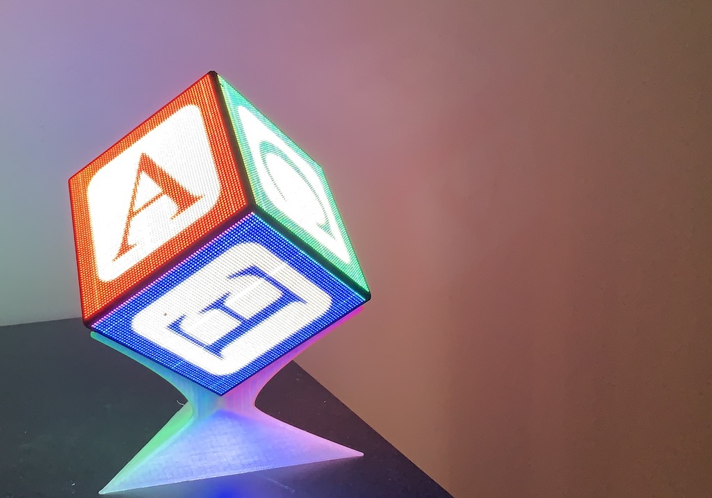

# LED Cube

A cube made of RGB LED panels.

I saw [Zaurak's and Polyfloyd's LED cubes](https://kbob.github.io/2019/08/23/led-cubes.html), and decided I wanted to make one too.  This one is smaller with denser LEDs.  (2mm pitch instead of 2.5mm)

# Overview

The cube's faces are six LED panels from Aliexpress.  Each panel has 64&times;64 RGB leds and is driven by the HUB75 protocol.

The chassis is a combination of 3D printed PLA, machine screws, and magnets.
The electronics can be installed and removed without tools.

The electronics consist of a Raspberry Pi connected via USB to an
[iCEBreaker FPGA](https://www.crowdsupply.com/1bitsquared/icebreaker-fpga)
dev board, HUB75 PMOD interface, and the panels.

Power is provided by an eight pack of 18650 batteries and a custom
power supply.  The power board also has an inertial measurement
unit (IMU), battery level monitoring, and soft power controls.

I also have two different display stands that prop the cube up on
one corner.  One stand disassembles for easy transport; the other, shown above,
is more stable and has a (bulky) carrying case.  All this is 3D printed.

# What's Here?

* **Mechanical/** CAD files, STL files, and parts lists.  The two
  display stands are here too.

* **Power Board/** KiCAD files and BOM for the custom power board.

* **Wiring/** Notes on the wiring harness.

* **Linux/** Notes on configuring Linux on the Raspberry Pi.

# What's Missing?

There are several different software options.  I outlined them in
[this 'blog post](https://kbob.github.io/2019-08-23/led-cubes.html).
None of them are in this repository.  I couldn't even begin
to write a comprehensive installation guide for them all.

The gateware is based on [tnt's excellent
ice40-playground](https://github.com/smunaut/ice40-playground).
But I have my own fork [here](https://github.com/kbob/ice40-playground).
My cube uses the `topic-cube` branch.  I haven't checked whether everything
in that branch has made it back upstream.

# What's Coming (I hope)?

## Raspberry Pi 4

My cube has a Raspberry Pi 3 Model A+.  (What a mouthful!)
Shortly after I built it, the Raspberry Pi foundation announced
the Raspberry Pi 4.  Its GPU is much better, and I really want to
get it into my cube.  But of course it's a different size;
I have to redesign part of the chassis to make it fit.

# Mesa OpenGL

I am using Broadcom's proprietary OpenGL.  I want to get the
open source Mesa GL running, but haven't figured out the magic
yet.  (It's complicated because I refuse to install an X11 server;
I only want offscreen rendering.)

# More LED Panels

**Update 2019-09-22:**  Good news!  1BitSquared now has [the correct
LED panels](https://1bitsquared.com/collections/embedded-hardware/products/led-panel)
in stock.  Get the ICN2037 variant.

The Aliexpress vendors do not ship a single version of the HUB75
panels.  Instead, you get whatever vendors happen to be available
surplus.  Each version has different driver chips, timing requirements,
mechanical layout, even power voltage requirements.  So today
the panels on the cube are irreplaceable.  If one dies, I'll
have no cube.

~~Esden is working on getting a reliable source for LED panels.
Follow him on twitter ([@esden](https://twitter.com/esden))
to stay up to date.~~
