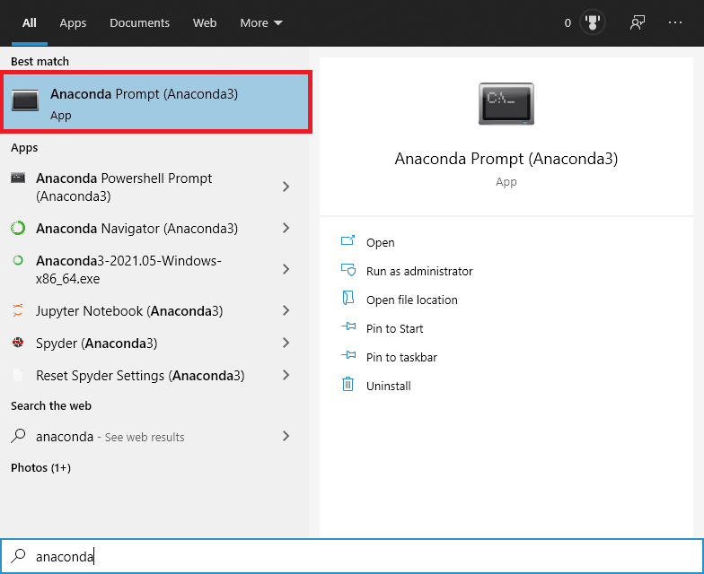
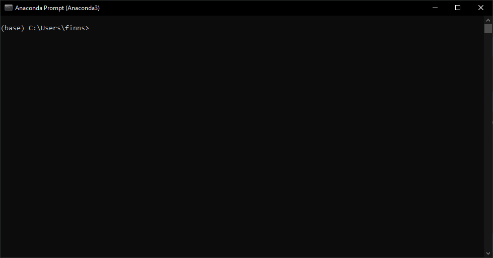
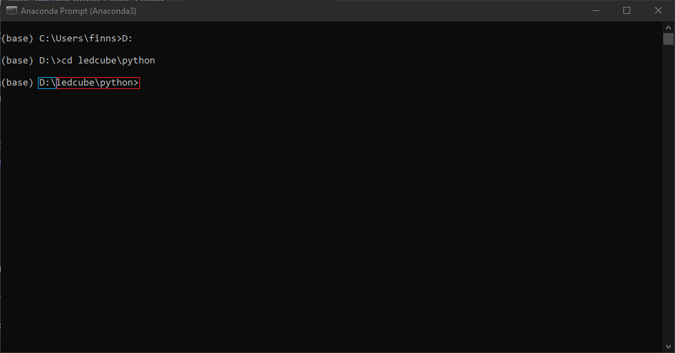
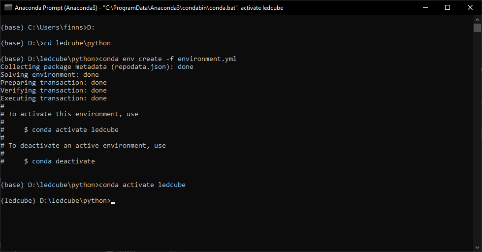
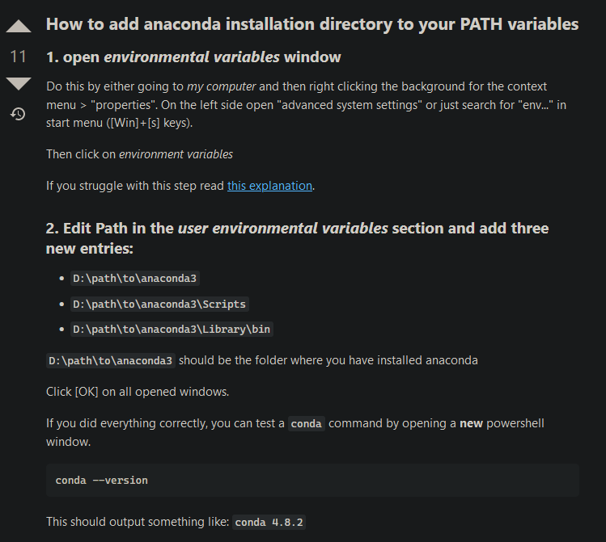

Jupyter Lab Notebooks
=====================

In the project there are a few jupyter notebooks that are used to do
calculations for finding the best bcm_lsb_len, refresh rate, and light
efficiency of the display. There is also one that is a simulator of the
display so that you can test and create animations faster than you could
with the vhdl code. It also allows you to create animations without the
fpga board or a display.

Instructions
------------

To get started with the notebooks you need to install anaconda. Go to
the anaconda website and install **Anaconda Individual Edition** on your
computer

`Anaconda \| Individual
Edition <https://www.anaconda.com/products/individual>`__

Once you have it installed hit the windows key and open the anaconda
prompt

When the prompt is open it should look something like this

Once you have it open, navigate to where you cloned the git repository.
In my case it is on my D:/ drive in my ledcube folder. **This will
probably be different for your computer.** Use “cd” and then a path to
navigate to wherever you cloned the repository. Now you should be in the
python folder inside the repository and your prompt should look
something like this. Your path in blue might be different than mine. The
path in red should be the same

Now run the command following command. Say yes to any administrator
prompts that come up

.. code:: bash

   conda env create -f environment.yml

Now everything is installed and ready to go!

To activate the conda environment use the first command below. To launch
jupyter labs use the second command. You must be in the conda envirnment
for all the correct packages to be loaded and ready to use in the
notebooks

.. code:: bash

   conda activate ledcube
   jupyter lab

Extra
-----

To run jupyter lab from a different directory than you are currently in

.. code:: bash

   jupyter lab --notebook-dir=D:/ledcube/python

