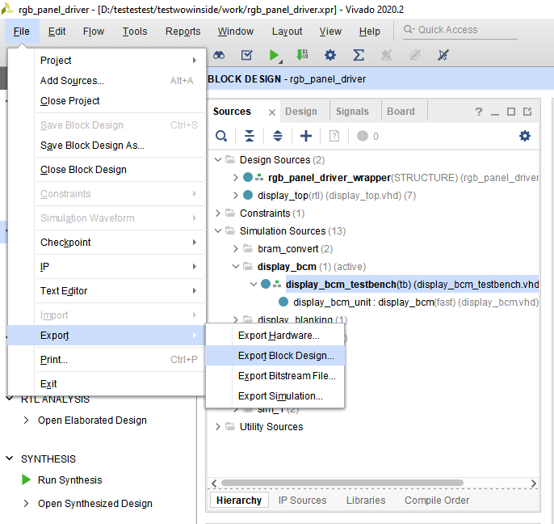
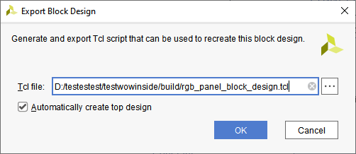

Vivado Revision Control
=======================

The basic idea is to just keep track of a few files and keep all the
sources in a remote directory where they can be version controlled.

Current Method
--------------

In order to version control I am using tcl scripts to generate all the
project files. These scripts will only need to be run when getting a new
commit from github. The scripts are in the **scripts** directory of the
github repository. Also inside the build directory is a build_project
batch file which will automatically rebuild the entire project. All you
need to do is make sure that Vivado 2020.2 is installed directly in your
C drive and the following path is accessible,

::

   C:\Xilinx\Vivado\2020.2\bin\vivado.bat

If you do not have vivado installed at this path, then edit the batch
script and replace this path with the path to this vivado file on your
computer.

The only folders with files for the fpga system that need to be tracked
by version control is the build, constraints, sources, and testbenches.
Other folders might have utilites and other useful scripts in them that
can also be tracked. The one folder to not track is the work directory.
This is the folder that the vivado project will be stored in and it
should not be added to version control.

Updating Block Diagram Tcl
--------------------------

Method 1
~~~~~~~~

Just run the write_block_design batch file. It will automatically create
a new block diagram tcl script. Make sure that the project has been
created first.

Method 2
~~~~~~~~

You should not have to edit the rgb_panel_driver_project.tcl script but
if you change the block diagram you will have to update the
rgb_panel_block_diagram.tcl file. To do this simply open the project in
vivado, **open the block design**, and then go to File → Export → Export
Block Design

Then you need to change the export path to the build folder and the
exported file name to rgb_panel_block_diagram.tcl. You will want to
overwrite the file that is already there. Make sure to check
“Automatically create top design”.

Once this finished you have successfully exported your new block design.

Video on using Version Control with Vivado
------------------------------------------

`Using Vivado Design Suite with Revision
Control <https://www.xilinx.com/video/hardware/vivado-design-suite-revision-control.html>`__

Folder Structure
----------------

-  Version Control Folder

   -  Project

      -  project.xpr
      -  project.srcs
      -  project.gen
      -  project.ip_user_files - Maybe?

   -  Sources
   -  Testbenches
   -  Constraints

   # TCL Script

   Also maybe look into using a tcl script to generate project file from
   script. Seems more versatile but more setup needed

   `Version control for Vivado
   projects <https://www.fpgadeveloper.com/2014/08/version-control-for-vivado-projects.html/>`__

   # Creating New build tcl file procedure

   1. Export tcl file in vivado: File → Project → Write Tcl

   search for design_1 in tcl file to see where it is sourced from
